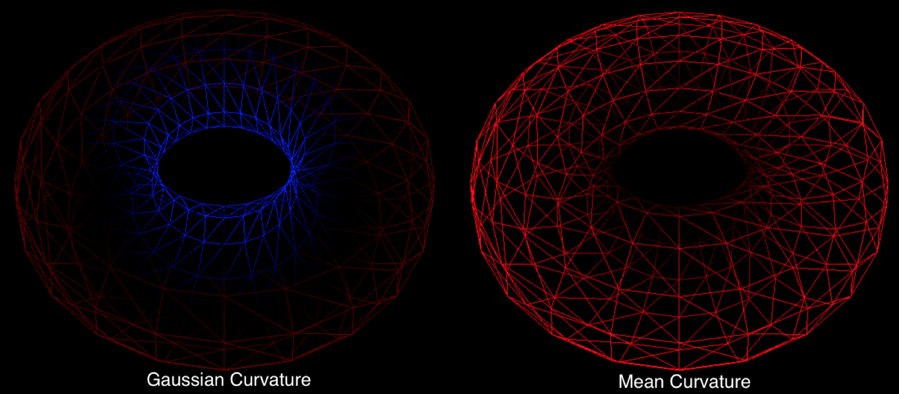
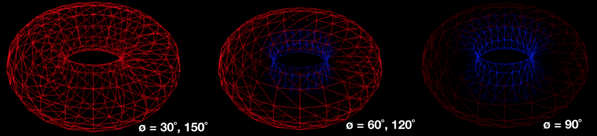

# Curvature
Curvature is the amount by which a geometric surface deviates from being flat. Different definitions of curvature exist, the most common being normal, gaussian and mean curvature. All three curvature values are defined locally for a mesh at every vertex and are determined from the principal direction vectors that define the plane tangent to a vertex. 

Given the principal directions with maximum curvature k1 and minimum curvature k2, normal curvature is defined as linear combination of the two:

kn(v) = k1 cos^2(ø) + k2 sin^2(ø)

(where ø is an offset from the first principal direction) while mean curvature is defined as the arithmetic mean H(v) = (k1 + k2) / 2 and gaussian curvature is defined as the geometric mean K(v) = k1 k2. 

Gaussian curvature is often used to classify surface points into three categories: elliptical points (K > 0) indicating local convexity, hyperbolic points (K < 0) indicating saddle-shaped surfaces, and parabolic points (K = 0) separating elliptical and hyperbolic regions. Furthermore, it is an intrinsic measure of curvature that depends only on distances that are measured on the surface and is invariant under isometry. For example, given a flat sheet of paper, the gaussian curvature of the sheet remains zero when it is folded into a cylinder. Normal and mean curvature however are extrinsic properties of the surface that depends on the surface’s embedding in space.  

Note: Requires Eigen 3.2.4 and assumes it is in /usr/local/Cellar/eigen/3.2.4/include/eigen3/
